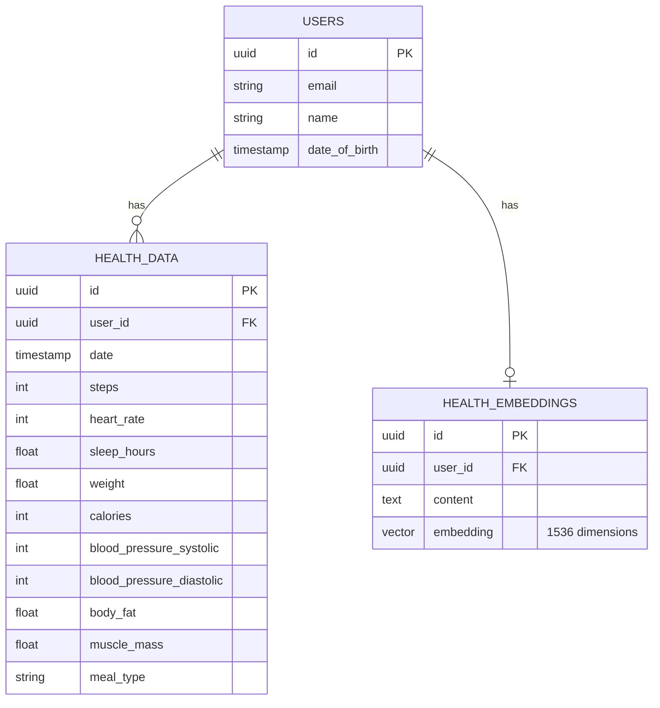

<div align="center">

# 💚 Vital+

### *Deine intelligente Gesundheitsplattform mit KI-Coach*

[](https://nextjs.org/)
[](https://react.dev/)
[](https://www.typescriptlang.org/)
[](https://openai.com/)
[](https://tailwindcss.com/)

<br/>


<br/>

**Eine moderne Fullstack-Gesundheitsplattform** mit KI-gestützter Foto-Analyse,  
RAG-basiertem Health-Coach und nativer iOS/Android-Unterstützung.

[🚀 Live Demo](#-demo-zugang) · [📖 Features](#-key-features) · [🛠 Tech-Stack](#-tech-stack) · [⚡ Quick Start](#-quick-start)

</div>

---

## 🎯 Warum Vital+?

> **Das Problem:** Gesundheitsdaten manuell einzugeben ist mühsam und zeitaufwendig.  
> **Die Lösung:** Vital+ nutzt **KI-Foto-Analyse** – einfach Essen, Blutdruckmessgerät oder Waage fotografieren und die Werte werden automatisch erkannt.

<table>
<tr>
<td width="33%" align="center">
<h3>📸</h3>
<b>Foto → Daten</b><br/>
<small>KI erkennt Kalorien, Blutdruck & Gewicht aus Fotos</small>
</td>
<td width="33%" align="center">
<h3>🧠</h3>
<b>RAG Health-Coach</b><br/>
<small>Personalisierte Empfehlungen basierend auf deinen Daten</small>
</td>
<td width="33%" align="center">
<h3>📱</h3>
<b>Native App</b><br/>
<small>Läuft als echte iOS & Android App via Capacitor</small>
</td>
</tr>
</table>

---

## ✨ Key Features

### 📸 KI-Foto-Analyse (NEU!)
Fotografiere einfach dein Essen, Blutdruckmessgerät oder deine Waage – die KI erkennt automatisch:

| Analyse-Typ | Erkannte Werte |
|-------------|----------------|
| 🍽️ **Essen** | Kalorien, Protein, Kohlenhydrate, Fett, Mahlzeittyp |
| 🩸 **Blutdruck** | Systolisch, Diastolisch, Puls, Kategorie |
| ⚖️ **Gewicht** | Gewicht, Körperfett, Muskelmasse, BMI |

> Powered by **OpenAI GPT-4o Vision** – die Werte werden direkt ins Formular übernommen.

### 🧠 KI-Health-Coach (RAG)
Die App nutzt **Vector Embeddings** in PostgreSQL, um deine Gesundheitsdaten semantisch zu analysieren:

- **Kontext-Analyse:** Erkennt Zusammenhänge wie *„Schlechter Schlaf nach hohem Kalorienkonsum"*
- **Personalisierte Tagespläne:** Ernährungs- und Trainingsempfehlungen in Echtzeit
- **Trend-Vorhersagen:** Langfristige Entwicklungen und Prognosen

### ⚡ Schnelleingabe
**Ein Klick – Daten gespeichert.** Vordefinierte Presets für:
- Mahlzeiten (Frühstück, Mittagessen, Abendessen, Snacks)
- Blutdruckwerte (Normal, Erhöht)
- Aktivität (6.000 / 10.000 Schritte)
- Schlaf (5,5h / 7,5h)

### 📊 Smart Dashboard
- **Interaktive Charts:** Recharts-basierte Visualisierung aller Vitaldaten
- **Echtzeit-Updates:** SWR-Caching mit automatischer Revalidierung
- **Smart Alerts:** Automatische Warnungen bei Anomalien
- **Trend-Erkennung:** Prozentuale Veränderungen im Vergleich zum Vortag

### 🔐 Enterprise-Grade Security
- **Session-basierte Auth:** Sichere Authentifizierung via NextAuth.js v5
- **API-Protection:** Jeder Endpoint prüft Ownership – Zugriff nur auf eigene Daten
- **Zod-Validierung:** Strikte Input-Validierung auf Server & Client

---

## 🛠 Tech-Stack

<table>
<tr>
<td valign="top" width="50%">

### Frontend
| Tech | Version | Zweck |
|------|---------|-------|
| ⚛️ **React** | 19.2 | UI mit Server Components |
| ▲ **Next.js** | 15.5 | App Router, Turbopack |
| 🎨 **Tailwind CSS** | 4.0 | Utility-first Styling |
| 🧩 **ShadCN UI** | Latest | Accessible Components |
| 📈 **Recharts** | 2.x | Datenvisualisierung |
| 🎭 **Framer Motion** | 11.x | Animationen |

</td>
<td valign="top" width="50%">

### Backend & Data
| Tech | Version | Zweck |
|------|---------|-------|
| 🐘 **PostgreSQL** | 15+ | Primäre Datenbank |
| 🔮 **pgvector** | 0.5+ | Vector Embeddings |
| 💧 **Drizzle ORM** | 0.30+ | Type-safe SQL |
| ☁️ **Neon** | Serverless | Managed Postgres |
| 🤖 **OpenAI** | GPT-4o | Vision & Chat AI |
| 🔐 **NextAuth.js** | 5.0 | Authentication |

</td>
</tr>
<tr>
<td valign="top">

### Mobile
| Tech | Version | Zweck |
|------|---------|-------|
| 📱 **Capacitor** | 7.x | Native iOS/Android |
| 🍎 **iOS** | 15+ | Native Runtime |
| 🤖 **Android** | SDK 24+ | Native Runtime |

</td>
<td valign="top">

### DevEx & Tooling
| Tech | Zweck |
|------|-------|
| 📦 **pnpm** | Package Manager |
| 🧪 **Playwright** | E2E Testing |
| 📝 **ESLint** | Code Quality |
| 🔷 **TypeScript** | End-to-end Type Safety |

</td>
</tr>
</table>

---

## 🏗 Architektur

```
┌─────────────────────────────────────────────────────────────────┐
│                        VITAL+ ARCHITECTURE                       │
├─────────────────────────────────────────────────────────────────┤
│                                                                  │
│   ┌──────────────┐     ┌──────────────┐     ┌──────────────┐   │
│   │   iOS App    │     │  Web App     │     │ Android App  │   │
│   │  (Capacitor) │     │  (Next.js)   │     │ (Capacitor)  │   │
│   └──────┬───────┘     └──────┬───────┘     └──────┬───────┘   │
│          │                    │                    │            │
│          └────────────────────┼────────────────────┘            │
│                               │                                  │
│                    ┌──────────▼──────────┐                      │
│                    │    Next.js API      │                      │
│                    │  ┌────────────────┐ │                      │
│                    │  │ /api/health    │ │ ◄── Auth Protected   │
│                    │  │ /api/search    │ │                      │
│                    │  │ /api/analyze   │ │ ◄── OpenAI Vision    │
│                    │  └────────────────┘ │                      │
│                    └──────────┬──────────┘                      │
│                               │                                  │
│          ┌────────────────────┼────────────────────┐            │
│          │                    │                    │            │
│   ┌──────▼──────┐     ┌──────▼──────┐     ┌──────▼──────┐      │
│   │  PostgreSQL │     │   OpenAI    │     │    SWR      │      │
│   │  + pgvector │     │   GPT-4o    │     │   Cache     │      │
│   └─────────────┘     └─────────────┘     └─────────────┘      │
│                                                                  │
└─────────────────────────────────────────────────────────────────┘
```

---

## ⚡ Quick Start

### Voraussetzungen
- Node.js 20+
- pnpm 9+
- PostgreSQL mit pgvector (oder Neon Account)
- OpenAI API Key

### Installation

```bash
# 1. Repository klonen
git clone https://github.com/Thomas7899/VitalPlus.git
cd VitalPlus

# 2. Dependencies installieren
pnpm install

# 3. Environment Variables konfigurieren
cp .env.example .env.local
# → DATABASE_URL, OPENAI_API_KEY, AUTH_SECRET eintragen

# 4. Datenbank migrieren
pnpm db:push

# 5. Development Server starten
pnpm dev
```

### iOS App bauen

```bash
# Capacitor Sync
pnpm cap sync ios

# Xcode öffnen
pnpm cap open ios
```

---

## 🗂 Datenmodell



---

## 📸 Demo-Zugang

> **Live auf Vercel deployed** – teste die App direkt im Browser!

| | |
|---|---|
| **Email** | `john.doe@example.com` |
| **Passwort** | `password123` |

---

## 🤝 Contributing

Contributions sind willkommen! Bitte erstelle einen Fork und einen Pull Request.

1. Fork the repository
2. Create your feature branch (`git checkout -b feature/AmazingFeature`)
3. Commit your changes (`git commit -m 'Add some AmazingFeature'`)
4. Push to the branch (`git push origin feature/AmazingFeature`)
5. Open a Pull Request

---

## 📄 Lizenz

Dieses Projekt ist unter der MIT-Lizenz lizenziert.

---

<div align="center">

**Made with 💚 and ☕ by [Thomas](https://github.com/Thomas7899)**

⭐ **Star this repo** if you find it useful!

</div>
